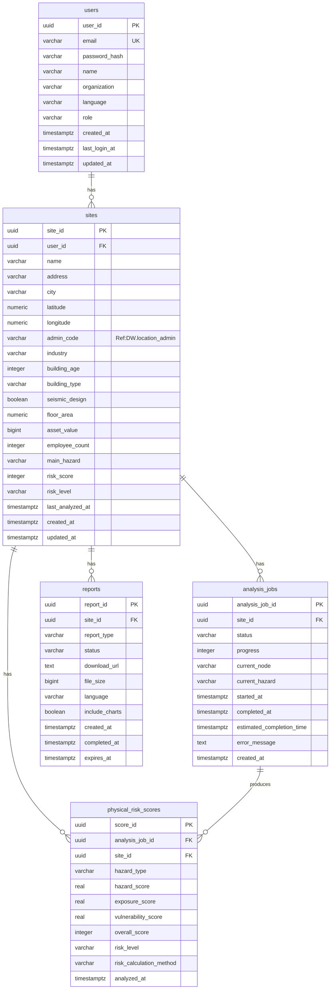
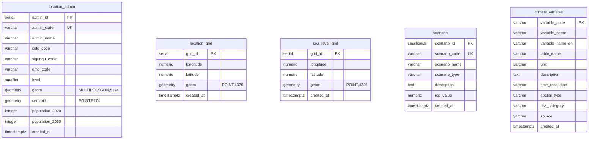
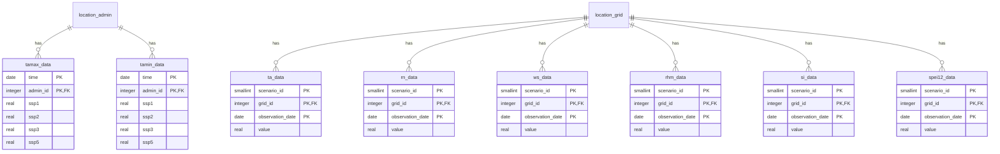
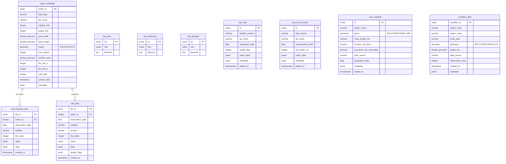
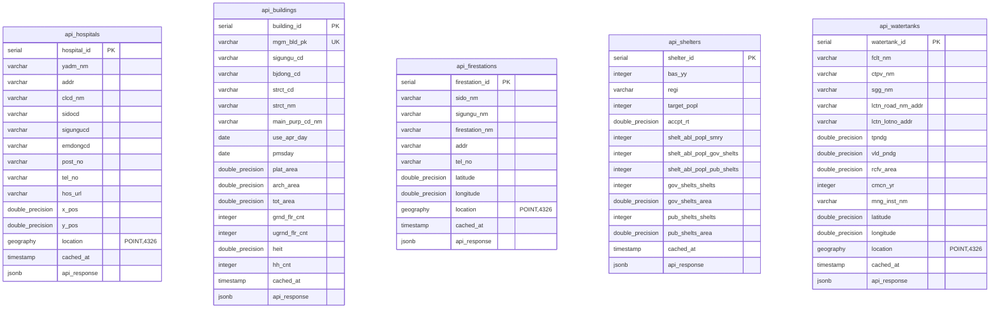
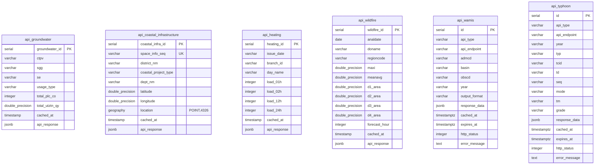
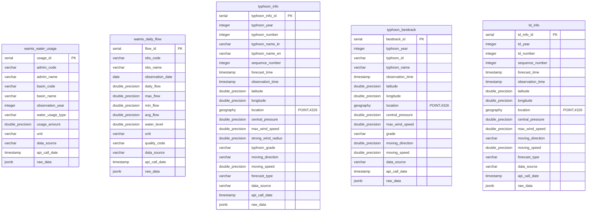
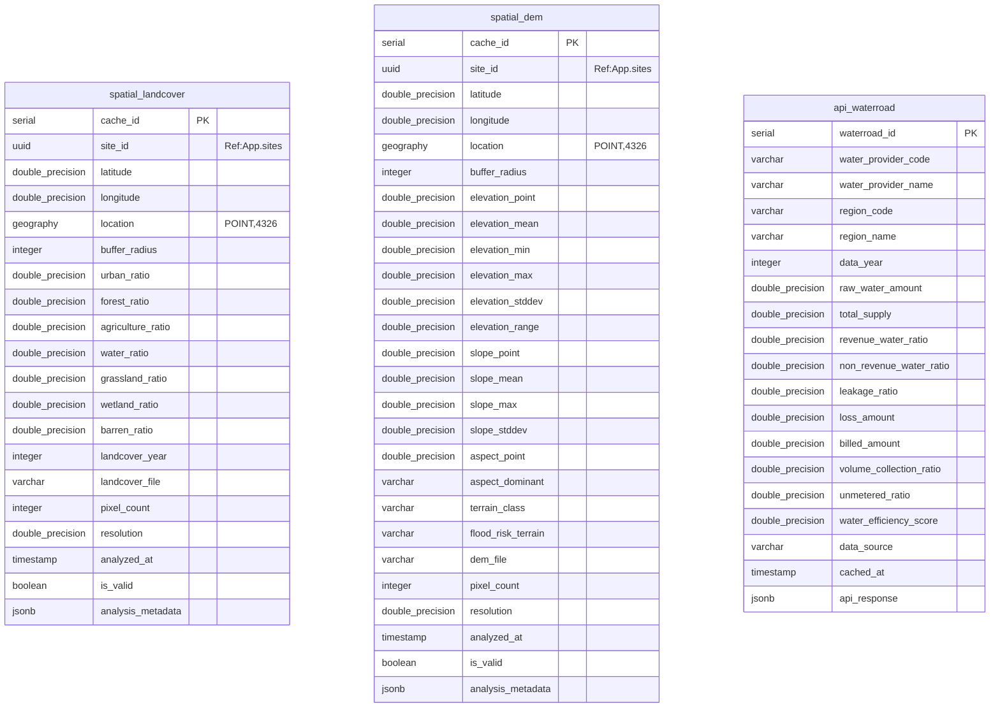

# SKALA Physical Risk AI - ERD 다이어그램

> SKALA Physical Risk AI System의 전체 데이터베이스 ERD
>
> 최종 수정일: 2025-11-24
> 버전: v02.2

---

## 📋 목차

1. [개요](#개요)
2. [데이터베이스 아키텍처](#데이터베이스-아키텍처)
3. [Application Database ERD](#application-database-erd)
4. [Datawarehouse ERD](#datawarehouse-erd)
5. [데이터베이스 간 참조](#데이터베이스-간-참조)

---

## 개요

SKALA Physical Risk AI 시스템은 **이중 데이터베이스 아키텍처**를 사용합니다:

- **Application DB** (포트 5432): Spring Boot 애플리케이션용 - 사용자, 사업장, 분석, 리포트 관리
- **Datawarehouse** (포트 5433): FastAPI AI Agent용 - 기후 데이터, 공간 데이터, API 캐시

---

## 데이터베이스 아키텍처

```
┌─────────────────────────────────────────────────────────┐
│                  SKALA Physical Risk AI                 │
├─────────────────────┬───────────────────────────────────┤
│  Application DB     │        Datawarehouse              │
│  (PostgreSQL 16)    │        (PostGIS 16-3.4)           │
│                     │                                   │
│  포트: 5432         │  포트: 5433                        │
│  테이블: 10개        │  테이블: 55개                      │
│  크기: ~100 GB      │  크기: ~2-3 TB                     │
└─────────────────────┴───────────────────────────────────┘
```

---

## Application Database ERD

### 개요
- **데이터베이스명**: `skala_application`
- **포트**: 5432
- **엔진**: PostgreSQL 16
- **Extension**: uuid-ossp
- **테이블 수**: 10개
- **주요 기능**: 사용자 관리, 사업장 관리, 분석 추적, 리포트 생성

### ERD (Mermaid)



### 테이블 목록

| 테이블명 | 설명 | 주요 컬럼 | 예상 행 수 |
|---------|------|----------|-----------|
| `users` | 사용자 정보 | email, password_hash, role | ~10,000 |
| `sites` | 사업장 정보 | latitude, longitude, admin_code | ~100,000 |
| `analysis_jobs` | AI 분석 작업 추적 | status, progress, current_node | ~1,000,000 |
| `physical_risk_scores` | 물리적 리스크 점수 캐싱 | hazard_score, exposure_score, vulnerability_score | ~10,000,000 |
| `reports` | 생성된 리포트 | report_type, download_url | ~500,000 |

---

## Datawarehouse ERD

### 개요
- **데이터베이스명**: `skala_datawarehouse`
- **포트**: 5433
- **엔진**: PostgreSQL 16 + PostGIS 3.4
- **Extension**: postgis, postgis_raster, uuid-ossp
- **테이블 수**: 55개
- **주요 기능**: 기후 데이터, 공간 데이터, API 캐시, 래스터 데이터

### ERD - Part 1: 위치 및 기후 메타데이터



### ERD - Part 2: 기후 데이터 테이블



### ERD - Part 3: 연별 기후 데이터

```mermaid
erDiagram
    %% Datawarehouse - Yearly Climate Data

    location_grid ||--o{ csdi_data : "has"
    location_grid ||--o{ wsdi_data : "has"
    location_grid ||--o{ rx1day_data : "has"
    location_grid ||--o{ rx5day_data : "has"
    location_grid ||--o{ cdd_data : "has"
    location_grid ||--o{ rain80_data : "has"
    location_grid ||--o{ sdii_data : "has"

    csdi_data {
        smallint scenario_id PK
        integer grid_id PK,FK
        integer year PK
        real value
    }

    wsdi_data {
        smallint scenario_id PK
        integer grid_id PK,FK
        integer year PK
        real value
    }

    rx1day_data {
        smallint scenario_id PK
        integer grid_id PK,FK
        integer year PK
        real value
    }

    rx5day_data {
        smallint scenario_id PK
        integer grid_id PK,FK
        integer year PK
        real value
    }

    cdd_data {
        smallint scenario_id PK
        integer grid_id PK,FK
        integer year PK
        real value
    }

    rain80_data {
        smallint scenario_id PK
        integer grid_id PK,FK
        integer year PK
        real value
    }

    sdii_data {
        smallint scenario_id PK
        integer grid_id PK,FK
        integer year PK
        real value
    }

    location_grid ||--o{ ta_yearly_data : "has"

    ta_yearly_data {
        smallint scenario_id PK
        integer grid_id PK,FK
        integer year PK
        real value
    }

    sea_level_grid ||--o{ sea_level_data : "has"

    sea_level_data {
        smallint scenario_id PK
        integer grid_id PK,FK
        integer year PK
        real value
    }
```



### ERD - Part 4: 래스터 데이터



### ERD - Part 5: API 캐시 테이블 (1/2)



### ERD - Part 6: API 캐시 테이블 (2/2)



### ERD - Part 7: 추가 기상 및 공간 데이터



### ERD - Part 8: 공간 캐시 테이블



### 테이블 목록 (Datawarehouse)

#### 위치 테이블 (3개)
| 테이블명 | 설명 | 주요 컬럼 | 예상 행 수 |
|---------|------|----------|-----------|
| `location_admin` | 행정구역 위치 정보 | admin_code, geom, population | 5,259 |
| `location_grid` | 격자점 위치 정보 | longitude, latitude, geom | 451,351 |
| `sea_level_grid` | 해수면 격자점 위치 | longitude, latitude, geom | 80 |

#### 기후 메타데이터 (2개)
| 테이블명 | 설명 | 주요 컬럼 | 예상 행 수 |
|---------|------|----------|-----------|
| `scenario` | SSP 기후 시나리오 | scenario_code, rcp_value | 4 |
| `climate_variable` | 기후 변수 메타데이터 | variable_code, time_resolution | 16 |

#### 기후 데이터 테이블 (15개)
| 테이블명 | 설명 | 시간 해상도 | 공간 유형 | 예상 행 수 |
|---------|------|------------|----------|-----------|
| `tamax_data` | 일 최고기온 | Daily | Admin | ~7.36M |
| `tamin_data` | 일 최저기온 | Daily | Admin | ~7.36M |
| `ta_data` | 평균기온 | Monthly | Grid | ~433M |
| `rn_data` | 강수량 | Monthly | Grid | ~433M |
| `ws_data` | 풍속 | Monthly | Grid | ~433M |
| `rhm_data` | 상대습도 | Monthly | Grid | ~433M |
| `si_data` | 일사량 | Monthly | Grid | ~433M |
| `spei12_data` | SPEI 12개월 | Monthly | Grid | ~433M |
| `csdi_data` | 한랭야 지수 | Yearly | Grid | ~36M |
| `wsdi_data` | 온난야 지수 | Yearly | Grid | ~36M |
| `rx1day_data` | 1일 최다강수량 | Yearly | Grid | ~36M |
| `rx5day_data` | 5일 최다강수량 | Yearly | Grid | ~36M |
| `cdd_data` | 연속 무강수일 | Yearly | Grid | ~36M |
| `rain80_data` | 80mm 이상 강수일수 | Yearly | Grid | ~36M |
| `sdii_data` | 강수강도 | Yearly | Grid | ~36M |
| `ta_yearly_data` | 연평균 기온 | Yearly | Grid | ~36M |
| `sea_level_data` | 해수면 상승 | Yearly | Sea Grid | ~6,880 |

#### 래스터 데이터 (11개)
| 테이블명 | 설명 | 데이터 타입 | 예상 크기 |
|---------|------|-----------|----------|
| `raw_dem` | DEM 래스터 | RASTER | ~100 GB |
| `raw_landcover` | 토지피복 래스터 | RASTER | ~50 GB |
| `raw_drought` | 가뭄 래스터 | RASTER | ~200 GB |
| `raw_ndvi` | NDVI 래스터 | RASTER | ~100 GB |
| `raw_soil_moisture` | 토양수분 래스터 | RASTER | ~150 GB |
| `raw_coastline` | 해안선 벡터 | MULTILINESTRING | ~1 GB |
| `raster_metadata` | 래스터 메타데이터 | - | ~1,000 rows |
| `coastline_data` | 해안선 데이터 | MULTILINESTRING | ~10,000 rows |
| `soil_moisture_tiles` | 토양수분 타일 | RASTER | ~1M rows |
| `ndvi_tiles` | NDVI 타일 | RASTER | ~1M rows |

#### API 캐시 테이블 (11개)
| 테이블명 | 설명 | 데이터 출처 | 용도 |
|---------|------|-----------|------|
| `api_hospitals` | 요양기관 정보 | 국민건강보험공단 | 폭염/한파 의료접근성 |
| `api_buildings` | 건축물대장 정보 | 국토교통부 | 건물 노후도 분석 |
| `api_firestations` | 소방서 정보 | 소방청 | 화재 대응 접근성 |
| `api_shelters` | 주민대피시설 | 행정안전부 | 재난 대피 인프라 |
| `api_watertanks` | 저수지/댐 | 표준데이터 | 가뭄 수자원 가용성 |
| `api_groundwater` | 지하수 이용 현황 | 한국수자원공사 | 가뭄 지하수 의존도 |
| `api_coastal_infrastructure` | 연안정비 시설 | 해양수산부 | 태풍/해안홍수 방재 |
| `api_heating` | 난방지수 | 한국지역난방공사 | 한파 난방 인프라 |
| `api_wildfire` | 산불위험지역 | 산림청 | 산불 리스크 |
| `api_wamis` | 용수이용량/유량 | WAMIS | 홍수/가뭄 |
| `api_typhoon` | 태풍 정보 | 기상청 | 태풍 위험 |

#### 추가 기상 데이터 (5개)
| 테이블명 | 설명 | 데이터 출처 | 예상 행 수 |
|---------|------|-----------|-----------|
| `wamis_water_usage` | 용수이용량 | WAMIS | ~100,000 |
| `wamis_daily_flow` | 실시간 일유량 | WAMIS | ~10M |
| `typhoon_info` | 태풍 정보 | 기상청 | ~100,000 |
| `typhoon_besttrack` | 태풍 베스트트랙 | 기상청 | ~50,000 |
| `td_info` | 열대저기압 정보 | 기상청 | ~20,000 |

#### 공간 캐시 테이블 (3개)
| 테이블명 | 설명 | 용도 | 예상 행 수 |
|---------|------|------|-----------|
| `spatial_landcover` | 토지피복 분석 캐시 | E(노출도) 계산 | ~1M |
| `spatial_dem` | DEM 분석 캐시 | E(노출도) 계산 | ~1M |
| `api_waterroad` | 상수도 수량분석 | V(취약성) 계산 | ~10,000 |

---

## 데이터베이스 간 참조

### Application → Datawarehouse 참조

**중요**: 두 데이터베이스 간 외래 키(FK)는 **존재하지 않습니다**. 애플리케이션 레벨에서 참조합니다.

| Application DB | Datawarehouse | 참조 방법 |
|---------------|---------------|----------|
| `sites.admin_code` | `location_admin.admin_code` | Application-level join |
| `sites.latitude, longitude` | `location_grid.latitude, longitude` | PostGIS spatial query |
| `analysis_jobs.site_id` | `spatial_landcover.site_id` | UUID matching |
| `analysis_jobs.site_id` | `spatial_dem.site_id` | UUID matching |

### 참조 예시 (Python)

```python
# Application DB에서 사업장 조회
site = get_site_from_application_db(site_id)
admin_code = site.admin_code  # 예: "1101010100"
latitude = site.latitude
longitude = site.longitude

# Datawarehouse에서 행정구역 정보 조회
admin_info = query_datawarehouse("""
    SELECT admin_name, population_2020, geom
    FROM location_admin
    WHERE admin_code = %s
""", (admin_code,))

# Datawarehouse에서 가장 가까운 격자점 조회
nearest_grid = query_datawarehouse("""
    SELECT grid_id, ST_Distance(geom, ST_SetSRID(ST_MakePoint(%s, %s), 4326)) as distance
    FROM location_grid
    ORDER BY distance
    LIMIT 1
""", (longitude, latitude))
```

---

## 통계 요약

### Application Database
- **테이블 수**: 5개
- **총 예상 행 수**: ~11,610,000 행
- **예상 크기**: ~100 GB
- **주요 관계**: users → sites → analysis_jobs → physical_risk_scores, reports

### Datawarehouse
- **테이블 수**: 55개
- **총 예상 행 수**: ~4,300,000,000+ 행 (43억+ 행)
- **예상 크기**: ~2-3 TB (래스터 포함)
- **주요 관계**:
  - location_grid → 기후 데이터 (15개 테이블)
  - location_admin → 일별 기후 데이터 (2개 테이블)
  - raster_metadata → 래스터 타일 (2개 테이블)

---

## ERD 시각화 도구

이 ERD는 다음 도구로 시각화할 수 있습니다:

1. **Mermaid Live Editor**: https://mermaid.live/
2. **dbdiagram.io**: https://dbdiagram.io/
3. **DBeaver**: Database 클라이언트 도구의 ER Diagram 기능
4. **pgAdmin**: PostgreSQL 관리 도구의 ERD 기능

---

**문서 작성**: SKALA Physical Risk AI Team
**최종 수정**: 2025-11-24
**버전**: v02.1
